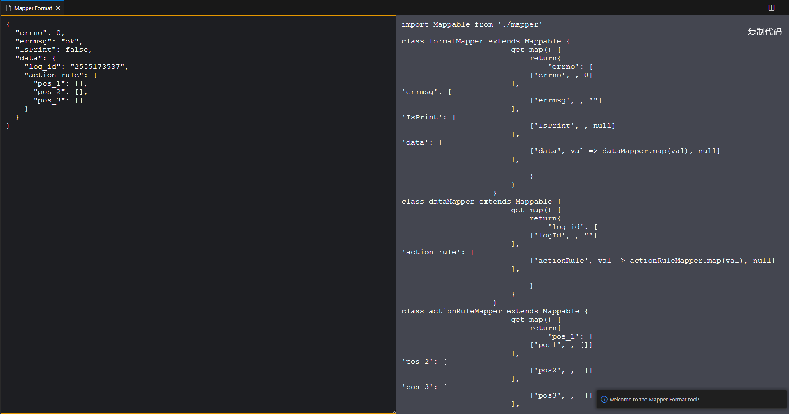

<!--
 * @Descripttion: 
 * @Author: wanganqi
 * @Date: 2023-05-05 11:20:13
 * @LastEditors: wanganqi
 * @LastEditTime: 2023-05-17 17:44:54
-->
# Mapper-Format VSCode插件
## 一个基于object-mapper的数据映射工具

### 快捷打开方式：Ctrl + F10 或使用Ctrl + Shift + p找到Mapper Format打开

